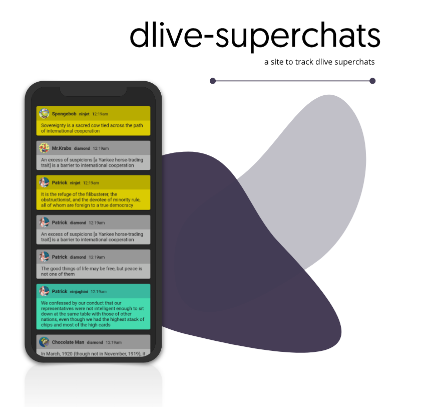

<div align="center">
    
    <h3><a href="https://zoomercode.github.io/dlive-superchats/#demo">zoomercode.github.io/dlive-superchats</a></h3>
    <p>Track your Dlive Superchats</p>

</div>

### Developmentment

Install dependencies

```sh
yarn
```

Start development server on `localhost:4141`

```sh
yarn start
```

Build for production

```sh
yarn build
```

### Motivation

On Dlive, creators can't view a log of all donations during a stream since they'll expire after a certain time. This app tracks superchats for the entirety you have your browser tab open.
